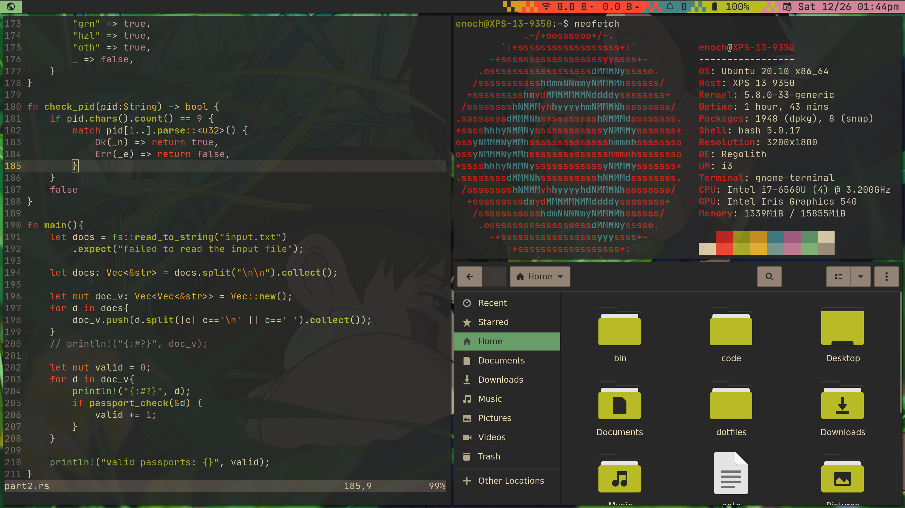

# Dotfiles for [Regolith Linux](https://regolith-linux.org/)
- DE: [Regolith Linux](https://regolith-linux.org/)
- Text [Editor: Neovim](https://neovim.io/)
- Bar: [i3blocks](https://github.com/vivien/i3blocks)/[i3xrocks](https://github.com/regolith-linux/i3xrocks#i3bar-properties)
- Themes and icons generated by [oomox](https://github.com/themix-project/oomox).
- Wallpaper: [HQ Ghibli Wallpapers](https://drive.google.com/drive/folders/1MPECo6qYJejKuYdIot6EgvfINvAPnTGv)

## Using these dotfiles
1. Assuming you have regolith installed, clone this repository.
```
git clone https://github.com/ec965/dotfiles-regolith.git
cd dotfiles-regolith
```
2. Copy the dotfiles to your config, theme and icons folders.
```
cp -r config/regolith ~/.config/regolith
cp -r icons ~/.icons
cp -r themes ~/.themes
cp -r Wallpapers ~/Pictures/Wallpapers
```
3. Reload regolith
```
regolith-look refresh
```

## Theme Variants
* [Gruvbox](https://github.com/morhetz/gruvbox)
* Material Palenight
### Changing Themes
1. Edit the Xresources file.
```
cd ~/.config/regolith
vi Xresources
```
Uncomment the theme you want to use, comment out the theme you do not want to use.
2. Update Rofi colors by running the `Xrasi.sh` script.
```
~/.config/regolith/styles/Xrasi.sh
```
3. Reload regolith
```
regolith-look refresh
```
### Editing the bar transition characters
1. Edit the Xresrouces file for the bar.
```
cd ~/.config/regolith/Xresources.d
vi i3
```
| Property | Effect |
| -------- | ------ |
| i3xrocks.after.icon | Character after the widget |
| i3xrocks.before.icon | Character before the widget |
| i3xrocks.<WIDGET_NAME>.before.color | Color of the character before the widget |
| i3xrocks.<WIDGET_NAME>.after.color | Color of the character after the widget |


